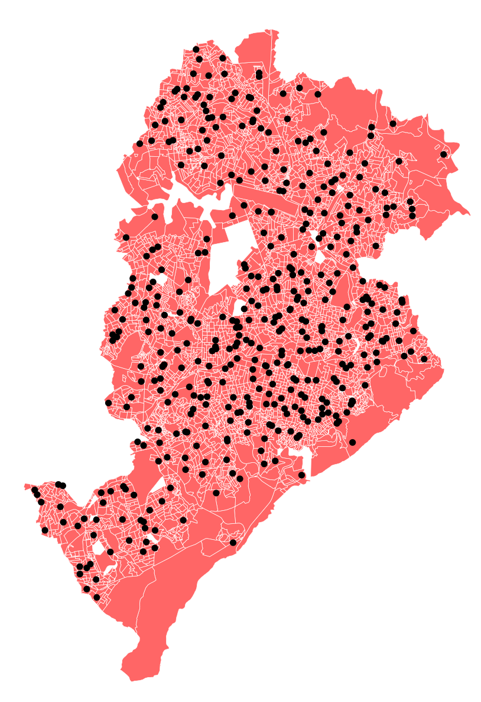
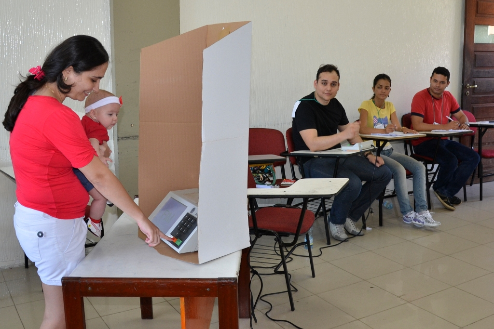
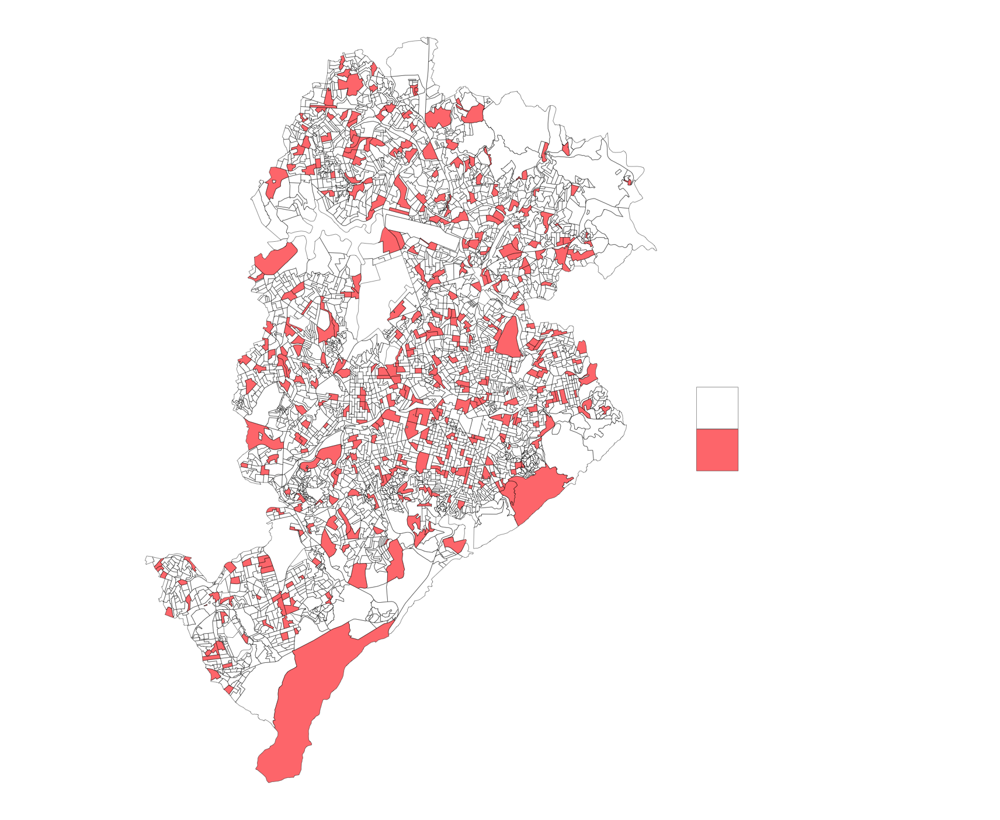
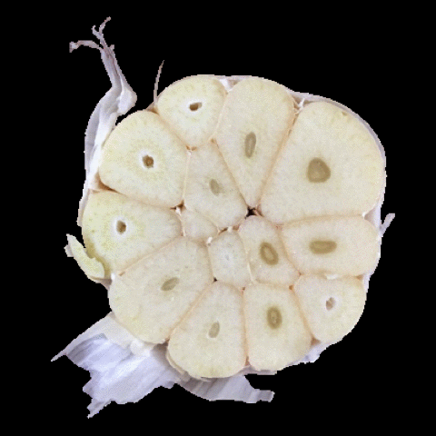
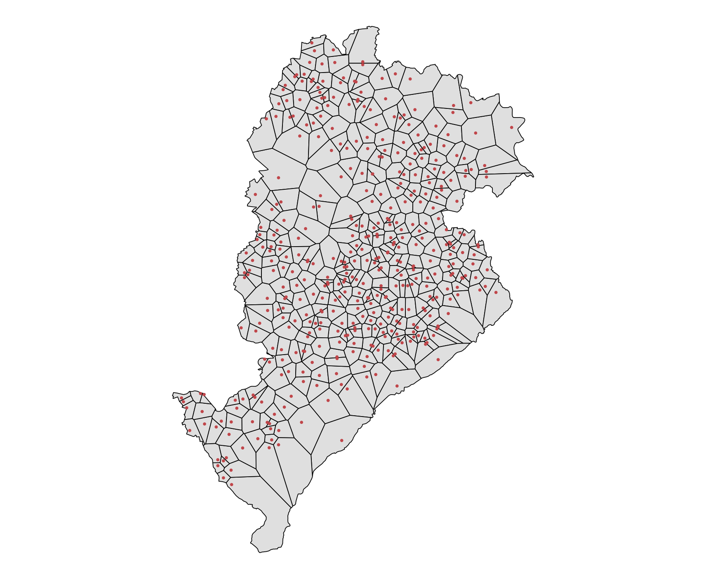
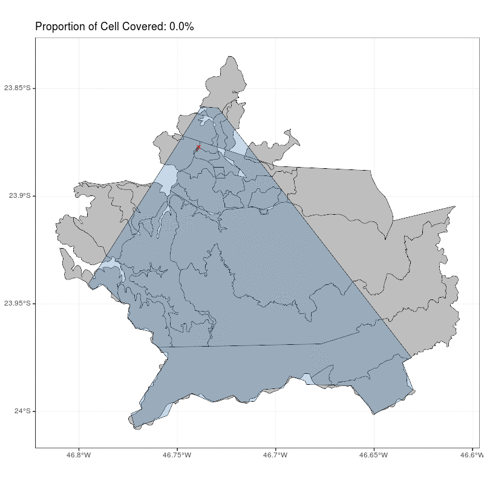
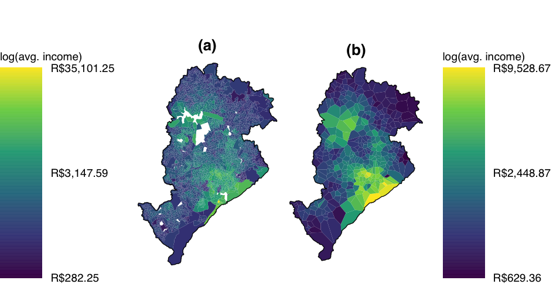
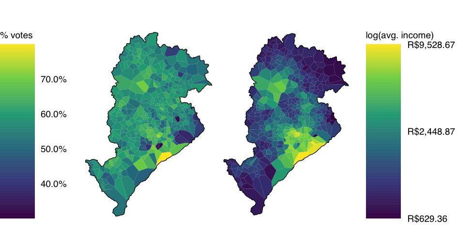
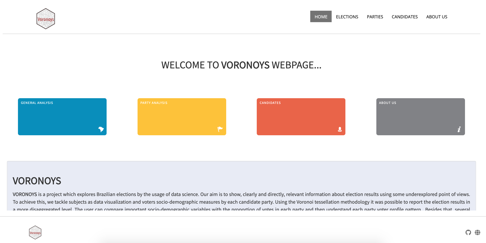
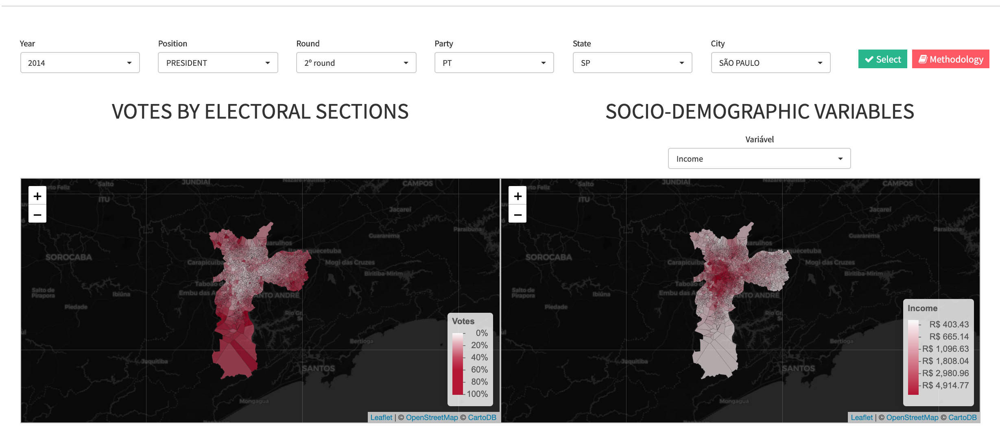

```{r setup, include=FALSE}
options(htmltools.dir.version = FALSE)
library(knitr)
knitr::opts_chunk$set(warning = FALSE, message = FALSE)
# options(knitr.table.format = "html")
library(tidyverse)
library(babynames)
library(fontawesome) # from github: https://github.com/rstudio/fontawesome
library(DiagrammeR)
```

layout: true
  
<div class="my-footer"><span>lgsilvaesilva.github.io/erum2020</span></div>

<!-- this adds the link footer to all slides, depends on my-footer class in css-->

---
name: xaringan-title
class: left

# Voronoi Linkage for Spatially Misaligned Data


### .fancy[How to transfer knowledge from areas to points?]

.large[Luís Silva e Silva | e-Rum 2020 | `r Sys.Date()`]

<!-- this ends up being the title slide since seal = FALSE-->

---

class: right, middle


### Find me at...

[`r fa(name = "twitter")` @lgsilvaesilva](http://twitter.com/lgsilvaesilva)  
[`r fa(name = "github")` @lgsilvaesilva](http://github.com/lgsilvaesilva)  
[`r fa(name = "link")` lgsilvaesilva.github.io](https://lgsilvaesilva.github.io)  
[`r fa(name = "paper-plane")` lgsilvaesilva@gmail.com](mailto:lgsilvaesilva@gmail.com)

---
name: electoral-system
class: center, middle, inverse

.pull-left[
# Brazilian <br>  .salt[.fancy[Electoral System]]
]

.pull-right[

# <br> `r fa("vote-yea", fill = "#AAAAAA", height = 250) `

]

---
name: motivation
class: left, middle, inverse
background-image: url(img/cover-map.png)
background-size: cover

- In Brazil there are three main political levels:

  1. Federal (president)
  1. State (governor)
  1. Municipality (mayor)

--

- The chief of each level is elected to a four-year term by .heatinline[absolute majority vote].  

--

- At state and federal levels a second-round might be needed.

--

- The .heatinline[mandatory voting] is for people with age between 18 and 65-year-old.


---
name: electoral-section
class: left, top

## Electoral section

.pull-left[
.center[]

The electoral sections for .saltinline[Belo Horizonte, Minas Gerais]. 
]

.pull-right[
- The place where the voters go to declare their vote.

- Usually, this place is a school or a community center.

- Each voter must attend to Electoral Section assigned.

- The assign of the electoral section to the voter is based on its home address.

.center[]
]

---
name: electoral-section
class: center, middle

.pull-left[
.center[]
]

.pull-right[
## How can we extract data from <br> .heat[.fancy[Areas to Points?]] 
]

---
name: naive
class: center, middle, inverse

.pull-left[
.center[]
]

.pull-right[

.salt[Naive approach]

.left[
- Each point gets the information from only one area, i.e., the area which the point belongs.

- .fatinline[9.884%] of census tracts used, while the percentage of the total population used is .fatinline[11.98%].
]


]

---
name: voronoi
class: center, middle, inverse
background-color: black

.pull-left[
# .salt[.fancy[Voronoi Tessellation]]
]

.pull-right[ 
# .center[]
]

---
name: voronoi
class: center, middle, inverse

.pull-left[
.center[]
]

.pull-right[

.salt[Voronoi approach]

.left[
- It is created a voronoi cell for each point (electoral section).

- Now, each point is represented by a cell. 

- The information is transferred .acidinline[proportionally the area intersection].
]
]

---
name: inter
class: center, middle

.center[]

---
name: motivation-question
class: center, middle, inverse

.pull-left[
# How are your <br>  .acid[.fancy[neighbours voting?]]
]

.pull-right[

# <br> `r fa("search-location", fill = "#AAAAAA", height = 250) `

]

---
name: electoral-data
class: center, top

## Spatial correlation

.center[]

---
name: electoral-data
class: center, top

## % votes Bolsonaro x avg. income

.center[]
---
name: electoral-data
class: center, top

### Explore our ShinyApp

.center[]

https://voronoys.shinyapps.io/voronoys/

---
name: electoral-data
class: center, top

### Explore our ShinyApp

.center[]

https://voronoys.shinyapps.io/voronoys/

---
name: conclusion
class: letf, top

# Conclusion

- Our approach seems efficient to aggregate information from areas to points;

- It provides analysis at a high level of detail;

- Also can improve the interpretation of geostatistical data for those who are not familiar with that

---
name: me
class: right, middle


.salt[Thank you!]

[`r fa(name = "twitter")` @lgsilvaesilva](http://twitter.com/lgsilvaesilva)  
[`r fa(name = "github")` @lgsilvaesilva](http://github.com/lgsilvaesilva)  
[`r fa(name = "link")` lgsilvaesilva.github.io](https://lgsilvaesilva.github.io)  
[`r fa(name = "paper-plane")` lgsilvaesilva@gmail.com](mailto:lgsilvaesilva@gmail.com)
